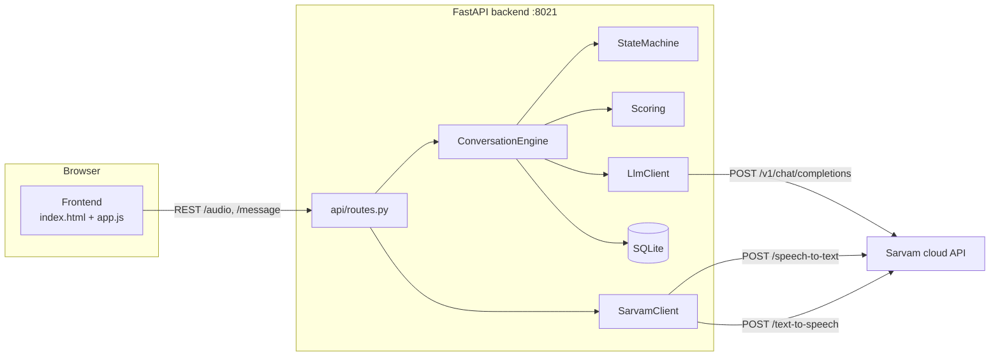

# Sarvam Cloud Lead Agent (MVP)

A **voice-first lead qualification agent** that runs on the **Sarvam AI cloud**
for speech. It uses Sarvam's **saaras:v3** (STT) and **bulbul:v3** (TTS) models,
plus either the Sarvam chat API (**sarvam-105b**) or any OpenAI-compatible LLM,
to hold a short conversation, extract lead details, capture contact consent,
score the lead deterministically, and export it as JSON/CSV. No local speech
models or microservices are required.

This project is **fully independent** from the `omnivoice-local-mvp` project in
the same parent folder. It has its own code, dependencies, environment
variables, SQLite database, Docker image, and HTTP port (8021). You can delete
the other project and this one keeps working.

> Port: **8021** · Speech: **Sarvam cloud** (`saaras:v3` STT / `bulbul:v3` TTS) ·
> LLM: **Sarvam chat** (`sarvam-105b`) or any OpenAI-compatible server

---

## Architecture



### Data flow

1. The user speaks (or types). Audio is validated and converted with **FFmpeg**
   to WAV in `backend/audio.py`.
2. `SarvamClient` sends it to `POST https://api.sarvam.ai/speech-to-text`
   (model `saaras:v3`) with the `api-subscription-key` header and receives a
   transcript.
3. `ConversationEngine.process_turn` builds messages (system prompt +
   collected fields + current state), calls the LLM, and asks it to reply with a
   **single structured JSON object** (`backend/llm_parsing.py`).
4. The backend **validates** the LLM's suggested `next_state`
   (`backend/state_machine.py`) and applies only legal transitions. The LLM
   never forces a state change.
5. Extracted fields are merged into the `Lead` row (`backend/conversation.py`);
   every change is recorded in `lead_field_history` for audit.
6. A **deterministic score** (`backend/scoring.py`) qualifies the lead:
   **cold (0–39) / warm (40–69) / hot (70–100)**.
7. The assistant reply is sent to `POST https://api.sarvam.ai/text-to-speech`
   (model `bulbul:v3`) and returned as base64 WAV for the browser to play.
   The detected call language is mapped to a valid `target_language_code`.
8. Confirmed leads can be exported as JSON or CSV
   (`/api/leads/{id}/export.json|.csv`).

### Features

- Voice + text conversation modes; push-to-talk and tap-to-talk
- **Outbound phone calls** via Twilio bidirectional Media Streams or Exotel
  AgentStream, with paced playback and live generation/playback barge-in
- English / Hindi / Hinglish detection and replies (TTS language auto-maps)
- 21-field structured lead capture with per-field change history
- Explicit **consent** gate (`consent_to_contact`) before the summary is shown;
  completion is refused without consent
- Deterministic scoring with recommended next actions
- Bounded retries with exponential backoff on transient API errors
- Structured-output repair: if the LLM returns invalid JSON it is asked once to
  fix it, then a safe fallback reply is used
- **Per-turn cost estimates in ₹** (STT per audio hour, TTS per 10k chars,
  LLM per million tokens) shown in the UI, metrics, and exports
- PII masking in logs (`backend/utils/logging.py`)
- SQLite persistence (`data/sarvam_leads.db`)
- JSON + CSV exports, session/lead management APIs
- Optional rate limiting (default 60 req/min)
- Docker image + compose file; tests run fully mocked (no key, no internet)

### Limitations

- **Requires a Sarvam API key** (`SARVAM_API_KEY`) for voice mode. Text mode
  still needs an LLM (Sarvam chat API or OpenAI-compatible server).
- Uses the paid **Sarvam cloud**; every STT/TTS call is billed per the Sarvam
  rate card. Costs shown are estimates from configurable rates.
- Requires **FFmpeg** on PATH for audio conversion.
- Requires an LLM endpoint (default: Sarvam chat API, model `sarvam-105b`).
- The LLM does the free-form language understanding; a weak model will produce
  lower-quality extractions. The backend still enforces structure, consent, and
  scoring.

---

## Quick start

Prerequisites: Python 3.11+, **FFmpeg**, a **Sarvam API key**, and an LLM
(Sarvam chat API key or any OpenAI-compatible server).

```powershell
# 1. Create and activate a virtual environment
python -m venv .venv
.\.venv\Scripts\Activate.ps1

# 2. Install dependencies
pip install -r requirements.txt

# 3. Configure (add your SARVAM_API_KEY and LLM_API_KEY)
Copy-Item .env.example .env
#   -> edit .env and set SARVAM_API_KEY=...

# 4. Start the server
.\scripts\run_dev.ps1        # or: python -m uvicorn backend.main:app --host 0.0.0.0 --port 8021

# 5. Open the UI
#    http://localhost:8021
```

Full step-by-step setup for beginners: see **[SETUP.md](SETUP.md)**.
If something breaks: see **[TROUBLESHOOTING.md](TROUBLESHOOTING.md)**.

---

## Configuration

All settings come from environment variables or a local `.env` file. See
[`.env.example`](.env.example) for the complete, documented list. Key ones:

| Variable | Default | Purpose |
| --- | --- | --- |
| `APP_PORT` | `8021` | HTTP port |
| `SARVAM_BASE_URL` | `https://api.sarvam.ai` | Sarvam cloud API |
| `SARVAM_API_KEY` | *(empty)* | Required; sent as `api-subscription-key` |
| `SARVAM_STT_MODEL` | `saaras:v3` | STT model |
| `SARVAM_REALTIME_STT_ENABLED` | `false` | Use persistent Saaras realtime STT for bidirectional calls |
| `SARVAM_REALTIME_STT_SILENCE_MS` | `400` | Base server endpointing silence |
| `SARVAM_SEMANTIC_ENDPOINTING_ENABLED` | `true` | Adjust VAD silence from partial transcript completeness |
| `SARVAM_TTS_MODEL` | `bulbul:v3` | TTS model |
| `SARVAM_TTS_SPEAKER` | `ritu` | TTS voice |
| `SARVAM_TTS_LANGUAGE_CODE` | `gu-IN` | Fallback TTS target language |
| `SARVAM_REALTIME_TTS_ENABLED` | `false` | Stream phone audio over persistent Bulbul WebSocket TTS |
| `LLM_PROVIDER` | `sarvam` | `sarvam` (chat API) or `openai-compatible` |
| `LLM_BASE_URL` | `https://api.sarvam.ai` | LLM endpoint |
| `LLM_MODEL` | `sarvam-105b` | LLM model name |
| `LLM_STREAMING_ENABLED` | `false` | Stream the structured phone response to TTS |
| `PHONE_LLM_REASONING_EFFORT` | `none` | Disable hidden reasoning on latency-sensitive phone turns |
| `MAX_AUDIO_MB` | `15` | Max upload size |
| `RETAIN_AUDIO` | `false` | Keep normalized WAVs in `storage/tmp/retained` |
| `DATABASE_URL` | `sqlite:///./data/sarvam_leads.db` | SQLite location |
| `STT_RATE_PER_HOUR_INR` | `30` | STT cost estimate per audio hour |
| `TTS_RATE_PER_10K_CHARS_INR` | `30` | TTS cost estimate per 10k chars |
| `LLM_INPUT_RATE_PER_MILLION_INR` | `4` | LLM input token rate |
| `LLM_OUTPUT_RATE_PER_MILLION_INR` | `16` | LLM output token rate |
| `TWILIO_ACCOUNT_SID` | *(empty)* | Twilio account SID (outbound calls) |
| `TWILIO_AUTH_TOKEN` | *(empty)* | Twilio auth token (never exposed to the browser) |
| `TWILIO_PHONE_NUMBER` | *(empty)* | The Twilio number calls are placed **from** (E.164) |
| `PUBLIC_BASE_URL` | *(empty)* | Public HTTPS URL (ngrok) so Twilio reaches this app |
| `TWILIO_TEST_PHONE_NUMBER` | *(empty)* | Verified fallback number allowed in trial mode |
| `TWILIO_VERIFIED_NUMBERS` | *(empty)* | Comma-separated extra verified fallback numbers |
| `TWILIO_TRIAL_MODE` | `true` | Restrict calls to Twilio-verified numbers |
| `TWILIO_STATUS_CALLBACK_URL` | *(empty)* | Status webhook URL (derived from `PUBLIC_BASE_URL` if empty) |
| `TELEPHONY_PROVIDER` | `twilio` | Default outbound carrier (`twilio` or `exotel`) |
| `EXOTEL_BASE_URL` | `https://api.in.exotel.com` | Exotel Mumbai Connect Voice AI API |
| `EXOTEL_ACCOUNT_SID` | *(empty)* | Exotel account SID |
| `EXOTEL_API_KEY` | *(empty)* | Exotel API key (server-side only) |
| `EXOTEL_API_TOKEN` | *(empty)* | Exotel API token (server-side only) |
| `EXOTEL_CALLER_ID` | *(empty)* | Exophone shown as caller ID |
| `EXOTEL_FLOW_ID` | *(empty)* | Existing app with a bidirectional Voicebot applet; optional |
| `CALL_RATE_LIMIT_PER_MINUTE` | `5` | Stricter limit for `POST /api/calls` |

> Backwards-compatible aliases: `TWILIO_FROM_NUMBER` (= `TWILIO_PHONE_NUMBER`)
> and `TWILIO_CALL_PUBLIC_BASE_URL` (= `PUBLIC_BASE_URL`) still work.

---

## API reference

| Method | Path | Description |
| --- | --- | --- |
| `GET` | `/health` | Health check (app + database) |
| `GET` | `/api/config` | Active configuration |
| `GET` | `/api/provider/status` | Sarvam + LLM reachability |
| `POST` | `/api/sessions` | Create a session (returns greeting) |
| `GET` | `/api/sessions/{id}` | Session + lead snapshot |
| `GET` | `/api/sessions/{id}/summary` | Turn count, latency, score, cost |
| `POST` | `/api/sessions/{id}/message` | Text turn `{"text": "..."}` |
| `POST` | `/api/sessions/{id}/audio` | Voice turn (multipart `file`, optional `retain_audio`) |
| `POST` | `/api/sessions/{id}/confirm` | Confirm/correct summary `{"confirmed": bool, "corrections": str?}` |
| `POST` | `/api/sessions/{id}/reset` | Reset to a fresh greeting |
| `DELETE` | `/api/sessions/{id}` | Delete a session |
| `GET` | `/api/leads` | List leads |
| `GET` | `/api/leads/{id}` | Lead detail |
| `GET` | `/api/leads/{id}/export.json` | JSON export |
| `GET` | `/api/leads/{id}/export.csv` | CSV export |
| `DELETE` | `/api/leads/{id}` | Delete a lead |

### Outbound phone calls (Twilio or Exotel)

The existing web UI and API continue to use Twilio by default. A request can
select Exotel with `{"to": "+91...", "provider": "exotel"}`, or deployments can
set `TELEPHONY_PROVIDER=exotel`. Both carriers use the same concurrent call
session and support **live barge-in** while generation or playback is active.

| Method | Path | Description |
| --- | --- | --- |
| `GET` | `/api/calls/numbers` | Verified destination numbers (populates the UI dropdown) |
| `POST` | `/api/calls` | Place a call `{"to": "+91...", "provider": "twilio"|"exotel"}`; provider is optional |
| `GET` | `/api/calls/{sid}` | Call status |
| `DELETE` | `/api/calls/{sid}` | Hang up |
| `POST` | `/api/calls/twiml` | TwiML served to Twilio (opens the Media Stream WebSocket) |
| `POST` | `/api/calls/status` | Status callback webhook (Twilio signature-validated) |
| `WS` | `/api/calls/stream` | Twilio Media Streams two-way audio |
| `WS` | `/api/calls/exotel/stream` | Exotel AgentStream two-way raw PCM/PCMU audio |

Setup (trial account):

1. Add `TWILIO_ACCOUNT_SID`, `TWILIO_AUTH_TOKEN` and `TWILIO_PHONE_NUMBER`
   (`+17372508034`) to `.env`.
2. Verify destination numbers in the **Twilio Console** (Outgoing Caller IDs).
   The call page dropdown is populated live from Twilio, so a newly verified
   number appears without any code change.
3. Run a public HTTPS tunnel to this app so Twilio can reach the Media Streams
   WebSocket and status webhook, e.g. `ngrok http 8021`, then set
   `PUBLIC_BASE_URL=https://abc123.ngrok-free.app`.
4. Restart and open the UI: choose a verified number from the dropdown and press
   **Call my phone**.

Exotel Connect Voice AI (Mumbai):

1. Set `EXOTEL_ACCOUNT_SID`, `EXOTEL_API_KEY`, `EXOTEL_API_TOKEN`, and
   `EXOTEL_CALLER_ID` in `.env`.
2. Set the account's API cluster (`https://api.in.exotel.com` for Mumbai or
   `https://api.exotel.com` for Singapore).
3. For an existing Exotel app, set `EXOTEL_FLOW_ID` and configure its Voicebot
   applet to connect to `wss://<public-host>/api/calls/exotel/stream`. Leave the
   flow ID empty only when the account supports direct Connect Voice AI.
4. Select Exotel per request or set `TELEPHONY_PROVIDER=exotel`.

For either paid bidirectional carrier, enable the custom realtime benchmark
cell with `SARVAM_REALTIME_STT_ENABLED=true`,
`SARVAM_REALTIME_TTS_ENABLED=true`, and `LLM_STREAMING_ENABLED=true`. The
buffered REST/local-VAD path remains the fallback if a realtime socket cannot
be established.

Security notes:

- Carrier credentials live only in the backend `.env`; they are never sent to
  the browser or logged. Provider errors are mapped to safe messages.
- `POST /api/calls/status` rejects any webhook whose
  `X-Twilio-Signature` cannot be verified with `TWILIO_AUTH_TOKEN`.
- Trial mode (`TWILIO_TRIAL_MODE=true`) blocks calls to anything not in the
  Twilio verified numbers (or `TWILIO_TEST_PHONE_NUMBER` /
  `TWILIO_VERIFIED_NUMBERS`). Set it to `false` on a paid account.
- `POST /api/calls` additionally respects `CALL_RATE_LIMIT_PER_MINUTE`.

### Structured LLM response shape

The LLM is expected to reply with a single JSON object:

```json
{
  "assistant_message": "your reply to the user",
  "detected_language": "en",
  "extracted_fields": {"field_name": "value"},
  "fields_to_clear": ["field_name"],
  "next_state": "requesting_consent",
  "conversation_complete": false,
  "needs_confirmation": false
}
```

If it is invalid, the engine sends one repair instruction and retries; on
failure it uses a safe fallback message.

---

## Cost estimation

Sarvam is a paid cloud service, so each turn reports an estimated cost:

- **STT** (`saaras:v3`) billed per audio hour: `duration_ms / 3.6e6 * rate`.
- **TTS** (`bulbul:v3`) billed per 10k characters: `chars / 1e4 * rate`.
- **LLM** billed per million tokens: `tokens / 1e6 * rate`.

The rates in `.env` are configurable and are **display estimates only** - the
Sarvam invoice is authoritative. Turn metrics (`metrics.estimated_provider_cost`)
and the session summary show the running total in ₹. Text-only turns only
charge the LLM; TTS is charged only when audio was actually synthesized.

---

## Scoring model

Scoring is 100% deterministic backend code (never the LLM). Full name +5,
contact method +15, requirement +15, interest +10, budget +15, timeline +15,
decision maker +10, company +5, consent +10.

| Level | Range | Next action |
| --- | --- | --- |
| Cold | 0–39 | Nurture list; re-qualify later |
| Warm | 40–69 | Follow up in a few days with a tailored solution |
| Hot | 70–100 | Route to sales immediately |

Completion is only allowed when identity + a contact method + a requirement are
known **and** the user has explicitly consented to being contacted.

---

## Managed pilot and four-cell benchmark

The credential-free managed Sarvam Voice Agents spec, compliance/residency
worksheet, 25-scenario multilingual corpus, safe runner, import formats, exact
acceptance gates, and external setup steps are in
[`benchmark/README.md`](benchmark/README.md). Keep `RETAIN_AUDIO=false`; the
runner never places calls or creates fake results.

```powershell
python -m backend.benchmarking validate
python -m backend.benchmarking prepare --run-dir storage\benchmarks\pilot-001 --run-id pilot-001 --calls-per-cell 25
python -m backend.benchmarking report --run-dir storage\benchmarks\pilot-001
```

---

## Testing

All tests run fully mocked - no Sarvam key, LLM, or internet.

```powershell
.\.venv\Scripts\python.exe -m pytest -q
```

A longer end-to-end script (mocked providers, full conversation + exports):

```powershell
.\.venv\Scripts\python.exe scripts\integration_test.py
```

Dependency checks that require the real cloud (they print warnings if a service
or key is missing):

```powershell
.\.venv\Scripts\python.exe scripts\check_sarvam.py
.\.venv\Scripts\python.exe scripts\check_llm.py
```

---

## Docker

```powershell
docker compose up --build
```

Only the backend container is built; all speech/LLM calls go to the Sarvam
cloud, so no extra services are needed. Put `SARVAM_API_KEY` in `.env`. The
SQLite file and `storage/` are mounted as volumes so data persists.

---

## Privacy & security

- Recordings are uploaded to the **Sarvam AI cloud** for transcription and
  synthesis - do not use this MVP with sensitive call content.
- Phone numbers and emails are masked in application logs.
- Consent is recorded explicitly and required before completion.
- The Sarvam API key is read from `.env`/environment only and sent as the
  `api-subscription-key` header; never commit the real `.env`.
- `RETAIN_AUDIO` is off by default; raw uploads are deleted immediately and
  normalized WAVs are cleaned up after each turn.
- The API binds to `0.0.0.0` by default (see `APP_HOST`). For a deployment
  exposed beyond localhost, put it behind TLS/a reverse proxy and enable CORS
  restrictions (`ALLOWED_ORIGINS`) or rate limiting.

## Sample conversations

**English**

```
agent> Hi! I'm an AI assistant calling from Vrattiks to understand what you
       need. May I ask your name first?
user>  My name is Rahul Sharma
agent> Thanks Rahul! What is the best phone number or email to reach you?
user>  9876543210
agent> Got it. What is your main requirement or what are you looking for?
user>  I need a CRM with voice automation for my retail business
agent> May I contact you later about this? (yes/no)
user>  Yes sure
agent> Here is the summary of your details. Can you confirm this is correct?
user>  Yes I confirm
agent> Confirmed! Your lead has been saved. Thank you!
```

**Hindi**

```
agent> नमस्ते! मैं Vrattiks की AI assistant हूँ। पहले आपका नाम बता सकते हैं?
user>  मेरा नाम राहुल शर्मा है
agent> धन्यवाद राहुल! आपका फ़ोन नंबर या ईमेल क्या है?
...
```

**Hinglish**

```
agent> Hi! Main Vrattiks ki AI assistant hoon. Pehle aap apna naam bata sakte ho?
user>  haan main rahul hoon
agent> Thanks Rahul! Aapka phone number ya email kya hai?
...
```
